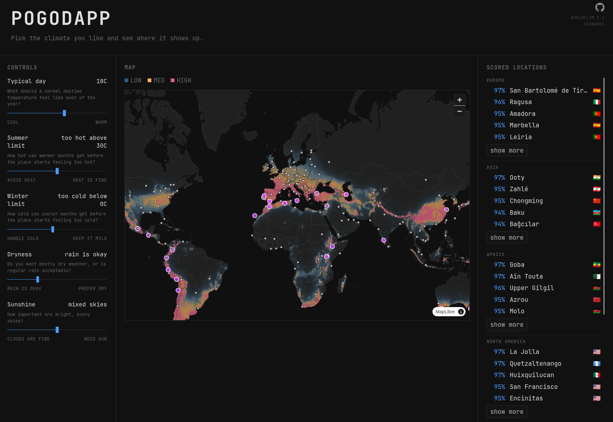

# Pogodapp

Pick the climate you like and see where it shows up. Pogodapp scores every land cell of WorldClim 2.1 long-term climate normals against a few preferences — typical daytime temperature, heat and cold tolerance, dryness, sunshine — then shows a world heatmap and ranks nearby cities per continent.

## How it works

A single FastAPI process serves the page, the API, and the map assets. The page renders once through Jinja2; after that, HTMX submits the preference sliders as a plain form. `POST /score` returns raw JSON with ranked cities plus a `heatmap_url`, and `htmx:afterRequest` hands the response to a render-only MapLibre script that draws the heatmap PNG and city markers. `GET /probe` returns a score breakdown for whichever cell you hover.

Scoring is temperature-first: a preferred daytime temperature is softened by how much summer heat and winter cold you tolerate. Dryness and sunshine only gain weight when you push their sliders away from neutral. Scores are normalized per request, so the best available match is `1.0`, and results are spread across regions so one area doesn't flood the list.

## Implementation

| Part | Responsibility |
| --- | --- |
| [Backend](backend/) | FastAPI routes, scoring, DuckDB access, heatmap rendering. |
| [Frontend](frontend/) | Jinja2 shell, HTMX form flow, render-only MapLibre map. |
| [Scripts](scripts/) | Building `data/climate.duckdb` from WorldClim GeoTIFFs. |

## Routes

| Route | Purpose | Rate limit |
| --- | --- | --- |
| `GET /` | Renders the app shell. | — |
| `POST /score` | Ranked cities plus a `heatmap_url` for the current preferences. | 30/minute |
| `GET /heatmap` | Rendered heatmap PNG, or `204` when nothing matches. | 30/minute |
| `GET /probe` | Score breakdown for one map point. | 120/minute |
| `GET /health` | Basic health check. | — |

Input fields and their ranges are listed in [Development](docs/development.md#scoring-inputs).

## Data

The runtime dataset is native WorldClim `5m` climate normals stored in `data/climate.duckdb`, generated at build time and never committed. When the database is missing, the app falls back to a small in-repo stub dataset; set `POGODAPP_BUILD_CLIMATE_DB_IF_MISSING=true` to build and validate a real database on startup instead. Production should keep generated data on persistent `data/` storage so bootstrap happens once.

[Development](docs/development.md) covers local setup, configuration, Docker, and checks.